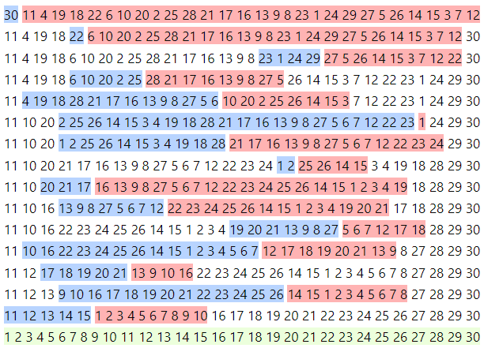

# 1.375-approximation algorithm for sorting by transpositions

Algorithm for sorting by transpositions based on an [algebraic approach](https://en.m.wikipedia.org/wiki/Abstract_algebra) with guarantee of [approximation ratio](https://en.m.wikipedia.org/wiki/Approximation_algorithm) of 1.375 for all permutations in the [Symmetric Group](https://en.wikipedia.org/wiki/Symmetric_group). For the details on the algorithm, please refer to the paper [A new 1.375-approximation algorithm for Sorting By Transpositions](https://almob.biomedcentral.com/articles/10.1186/s13015-022-00205-z) by L. A. G. Silva, L. A. B. Kowada, N. R. Rocco and M. E. M. T. Walter.

This project requires Maven version 3.6.3+ and Java JDK 11+.

Before running any of the commands below, first compile the project using the command

`mvn compile`

To execute the proposed algorithm, run the command

`mvn exec:java -Dexec.mainClass="br.unb.cic.tdp.Silvaetal" -Dexec.args="<first_arg>"`

where the first argument is the permutation to be sorted, e.g, `20,10,14,1,7,9,5,3,17,6,15,19,13,16,12,4,11,8,2,18` (longer random permutations [here](https://github.com/luizaugustogarcia/tdp1375/tree/master/src/main/resources/datasets) &mdash; disregard the first zeros). Be aware that, before executing the algorithm itself, a large dataset generated from a (huge) case analysis has to be loaded into memory. This demands a significant amount of memory (~2GB) and it takes about 15 seconds to complete on a computer equipped with an 11th Gen Intel Core i9-11950H processor with 32GB DDR4 RAM and a NVMe SSD hard disk. Make sure your computer has enough memory available.

Now, to run the case analysis referred above, which is the base of the correctness proof of the algorithm, use the command

`mvn exec:java -Dexec.mainClass="br.unb.cic.tdp.proof.ProofGenerator" -Dexec.args="<first_arg>"`

where the first argument indicates the directory which the proof will be generated into.

> Note: the command above will use all CPU cores of the host machine and can take hours or even days to finish, depending on the CPU power

The case analysis generated by the command above is hosted [here](http://tdp1375proof.s3-website.us-east-2.amazonaws.com/).

# What is "sorting by transpositions" actually?

Informally, a _transposition_ is the operation of cutting a block of symbols from a permutation and then pasting it elsewhere (in the same permutation), or, equivalently, swapping two adjacent blocks of symbols. So, the question arises: what is the minimum number of transpositions needed to sort a permutation? Indeed, this is an [NP-hard](https://en.wikipedia.org/wiki/NP-hardness) problem  &mdash; a proof for this fact can be found [here](https://epubs.siam.org/doi/abs/10.1137/110851390).

The present algorithm is able to sort any permutation using a maximum of 1.375 _times_ a known lower bound (the minimum number of transpositions needed to perform the sort is greater than or equal to this lower bound).

In the example below, the permutation `30,11,4,19,18,22,6,10,20,2,25,28,21,17,16,13,9,8,23,1,24,29,27,5,26,14,15,3,7,12` is sorted using 15 transpositions

    

