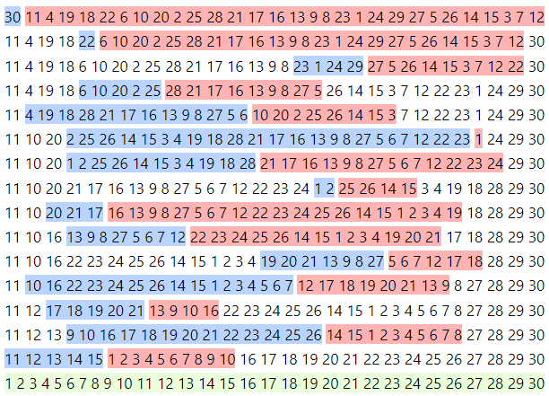

# 1.375-Approximation Algorithm for Sorting by Transpositions

This project implements an algorithm for sorting by transpositions with an approximation ratio of 1.375 for all permutations in the Symmetric Group. The algorithm and its details are presented in the paper "[A new 1.375-approximation algorithm for Sorting By Transpositions](https://almob.biomedcentral.com/articles/10.1186/s13015-022-00205-z)" by L. A. G. Silva, L. A. B. Kowada, N. R. Rocco, and M. E. M. T. Walter.

This version accelerates the proof generation (case analysis) by offloading the backtracking search to the GPU via CUDA. The CPU-only version used to produce the results in the paper is available under the git tag [`1.0.0-article`](../../tree/1.0.0-article).

## Requirements

- Java JDK 21+
- Maven 3.6.3+
- NVIDIA CUDA Toolkit (11.0+)
- CMake 3.24+
- An NVIDIA GPU with compute capability 6.0+ (Pascal or newer)

## Compilation

Before running any commands, compile the project with:

```sh
mvn compile
```

This will automatically build the native CUDA library (`libtdp1375_jni.so`) via CMake during the Maven build.

## Running the Algorithm

To execute the proposed algorithm, use the command:

```sh
mvn exec:exec -Dexec.mainClass="br.unb.cic.tdp.Silvaetal" -Dexec.args="<permutation>"
```

Replace `<permutation>` with the permutation to be sorted, for example:

```sh
mvn exec:exec -Dexec.mainClass="br.unb.cic.tdp.Silvaetal" -Dexec.args="20,10,14,1,7,9,5,3,17,6,15,19,13,16,12,4,11,8,2,18"
```

**Note:** The algorithm relies on a large dataset produced by the case analysis, which is loaded into memory at startup. This requires approximately 2 GB of heap space and takes around 15 seconds on a machine with an Intel Core Ultra 9 185H, 64 GB DDR5 RAM, and an NVMe SSD. Ensure sufficient memory is available before running.

## Running the Case Analysis

To generate the case analysis, which forms the basis of the algorithm's correctness proof, use:

```sh
mvn exec:exec -Dexec.mainClass="br.unb.cic.tdp.proof.ProofGenerator" \
  -Dexec.args="<output_dir> <devices_count> <slots_per_device> <queue_mb_budget> <dedup_table_size> <max_ratio> <max_depth>"
```

### Parameters

| Parameter | Description                                                                                                         |
|-----------|---------------------------------------------------------------------------------------------------------------------|
| `output_dir` | Directory for the proof output                                                                                      |
| `devices_count` | Number of NVIDIA GPUs to use                                                                                        |
| `slots_per_device` | Number of concurrent search slots per GPU (each slot uses a dedicated CUDA stream with pre-allocated device memory) |
| `queue_mb_budget` | Memory budget in MB for the per-slot backtracking work queues                                                       |
| `dedup_table_size` | Size of the hash table used for state deduplication on the GPU                                                      |
| `max_ratio` | Maximum approximation ratio to accept (e.g., `1.375`)                                                               |
| `max_depth` | Maximum number of transpositions to search (e.g, `11`)                                                                |

### Example

```sh
mvn exec:exec -Dexec.mainClass="br.unb.cic.tdp.proof.ProofGenerator" \
  -Dexec.args="output 1 2 3000 2000000 1.375 11"
```

This launches the proof generation using 1 GPU, 2 slots per device, ~3GB queue budget per slot, a dedup table with 2M entries, targeting ratio 1.375 with a maximum search depth of 11.

The generated case analysis is available [here](http://tdp1375proof.s3-website.us-east-2.amazonaws.com/).

## Architecture

The GPU-accelerated proof generation works as follows:

1. **Java orchestration layer** — A `ForkJoinPool` explores the space of permutation configurations, spawning search tasks for each case.
2. **JNI bridge** — `GPUSortingSearch` manages a pool of GPU slots distributed round-robin across available devices and dispatches search requests via JNI.
3. **CUDA backtracking kernel** — A persistent warp-parallel kernel performs DFS-like expansion of the search tree. Each warp operates on its own circular work queue with work-stealing support, while a shared hash table prunes previously visited states.
4. **GPU permutation filter** — A massively parallel kernel that enumerates and filters permutations by structural properties (oriented triples, cycle conditions), used during the extension phase.

## What is "Sorting by Transpositions"?

A _transposition_ consists in cutting a block of symbols from a permutation and pasting it elsewhere within the same permutation, or equivalently, swapping two adjacent blocks of symbols. The challenge is to determine the minimum number of transpositions required to sort a given permutation. This problem is NP-hard, as proven [here](https://arxiv.org/pdf/1011.1157).

The presented algorithm sorts any permutation using at most 1.375 times the known lower bound for the minimum number of transpositions needed.

For example, the permutation `30,11,4,19,18,22,6,10,20,2,25,28,21,17,16,13,9,8,23,1,24,29,27,5,26,14,15,3,7,12` is sorted using 15 transpositions:

<div align="center">
    
</div>

## Additional Resources

- Longer random permutations are available [here](https://github.com/luizaugustogarcia/tdp1375/tree/master/src/main/resources/datasets) (ignore the leading zeros).
